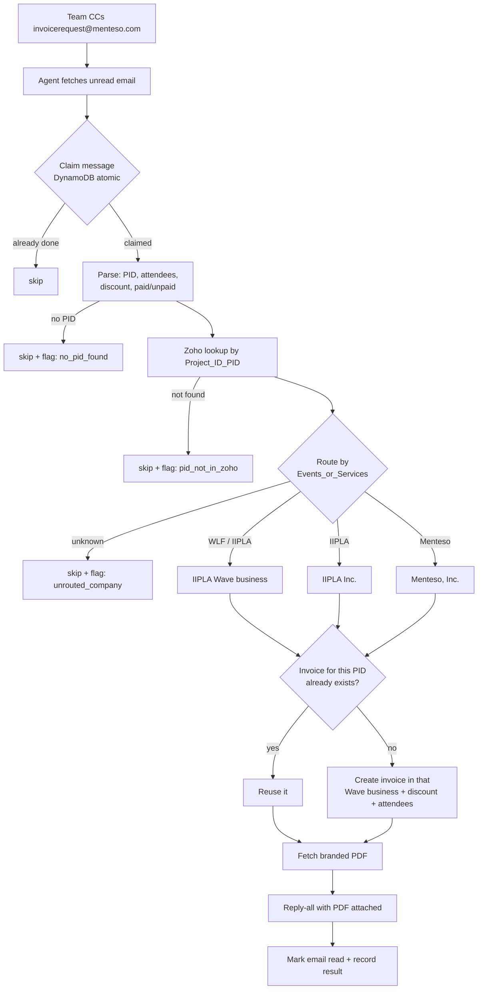

# Invoice Request Agent — Complete Guide

Everything about this agent in one place: what it does, how a request flows
through it, the business rules it follows, how it's built, and what a new person
needs to understand. For **credential setup** see [docs/SETUP.md](docs/SETUP.md).

---

## 1. What it does

An autonomous service that turns **invoice-request emails into sent invoices** for
**three companies**, with no human in the loop.

When a request lands, the agent:
1. reads the email and extracts the **PID** (Project ID) plus any attendees,
   discount, and paid/unpaid intent,
2. looks the PID up in **Zoho CRM** (the Deals/Opportunities module),
3. decides **which billing business** applies (IIPLA or Menteso, Inc.) from the
   deal's `Events_or_Services` field,
4. creates the invoice in **that company's Wave business**, and
5. **replies-all** to the thread with the branded invoice PDF attached.

It runs on **AWS Lambda** and authenticates with credentials that **never expire**.

---

## 2. How it's triggered

The team **CCs `invoicerequest@menteso.com`** on their invoice-request email
(often a forwarded thread). That CC lands in the invoicerequest@ inbox, and the
agent — which watches that inbox — picks it up and processes it automatically.

- **Mode:** full auto-send (no human approval step).
- **Watching:** a scheduled poll (safety net) + optional real-time Gmail push
  (Pub/Sub → API Gateway). Either way the trigger is "a new email in the inbox."

---

## 3. End-to-end flow



**Steps in code** (`src/pipeline.py` → `process_one`):
`claim → parse → Zoho find_by_pid → companies.route → merge extras → Wave.generate → reply_all → mark_read → record`.
Any step failing on one email is caught and recorded; it never blocks other emails.

---

## 4. Billing businesses & routing

The routing key is the Zoho deal's
**`Events_or_Services`** field (a multi-select). Defined in `src/companies.py`.

| `Events_or_Services` contains | Company | Wave business |
|---|---|---|
| `WLF…` (e.g. "WLF 2026 Europe") | **WorldLawyerForum** | International Intellectual Property Law Assn. Inc. |
| `IIPLA…` (e.g. "IIPLA 2026 USA", "IIPLA Services") | **IIPLA** | International Intellectual Property Law Assn. Inc. |
| `Menteso…` (e.g. "Menteso Services") | **Menteso** | Menteso, Inc. (US) |
| `LexMom…` / `lexmom.com` | **LexMom** | Menteso, Inc. (US) |
| `MyEventTrip…` / `myeventtrip.com` | **MyEventTrip** | Menteso, Inc. (US) |
| anything else / blank | — | **skip + flag** (never guess the billing entity) |

- WorldLawyerForum and IIPLA always bill through the **IIPLA** Wave business.
- Menteso.com, LexMom.com and MyEventTrip.com always bill through the
  **Menteso, Inc.** Wave business.
- **ANF Global Inc. is prohibited. AccountantAgent must never create, update,
  reuse or send an invoice from the ANF Wave business.** The Wave client contains
  a hard deny-list check in addition to the routing rules.
- Menteso Technologies Pvt. Ltd. is not used by AccountantAgent.
- Business IDs + income accounts are constants in `src/companies.py` (not secrets;
  the Wave API token is the secret).

---

## 5. Business rules

These are the decisions the agent encodes. They were confirmed with the team.

1. **One invoice per PID.** Before creating, the agent searches the company's Wave
   for an invoice whose `poNumber` == the PID. If found, it **reuses** it (fetches
   that PDF) instead of creating a duplicate. So if several people request the same
   PID, they all get the **same** invoice.
2. **Multi-attendee = one invoice, group total.** When a client buys the same thing
   for multiple people (e.g. IIPLA/WLF event passes), it's **one invoice** billed to
   the Zoho client, and the **Zoho deal `Amount` is the whole-invoice total** (group
   deals carry the group total). Attendee names are listed on the invoice line.
   *(This is "option a" — the agent never multiplies the amount by headcount.)*
3. **Discounts** written in the email ("apply 100 USD as a discount") are applied as
   a **FIXED** discount on the invoice.
4. **Paid vs Unpaid** comes from the request wording/subject. The invoice's status
   always reflects **reality** — the agent never fabricates a paid status.
   Until Wave payment verification/recording is wired, a paid-invoice request is
   held for review and does not create or email an unpaid PDF.
5. **Customer (bill-to)** defaults to the linked **Zoho Account**, then Contact,
   then Deal name only as a fallback.
   If the email explicitly specifies customer details, those take precedence.
   *(Email-override and putting the client's email on the invoice are not yet wired.)*
6. **Reply-all** — the invoice goes back to the sender **and** everyone on To/Cc
   (minus the agent's own mailbox), threaded under the original, PDF attached.
7. **Unknown company / no PID / PID not in Zoho → skip and flag**, never guess.
8. **Exactly-once** — each email is atomically claimed before work starts, so the
   poll and push can never double-send.

---

## 6. What the agent understands from an email

The parser (`src/parser.py`) reads the subject + body (including forwarded/quoted
threads) and extracts:

- **PID** — canonical `PID#######`, or labelled forms like `PID: 12345`,
  `Project ID: …`. (Falls back to Claude if a key is configured and regex misses.)
- **Attendees** — `Name (email@domain)` pairs (e.g. an event delegate list). It
  ignores plain signature addresses like "Email anchal@menteso.com".
- **Discount** — "apply 100 USD discount", "discount of $100", "100 USD discount".
- **Paid/Unpaid** — keywords in the subject/body ("paid invoice", "unpaid",
  "outstanding", …).

---

## 7. Data sources & key fields

**Zoho CRM — Deals module** (looked up by PID via the records/search API; COQL
needs a scope the token lacks):

| Field (API name) | Used for |
|---|---|
| `Project_ID_PID` | the PID (lookup key) |
| `Events_or_Services` | **company routing** |
| `Amount` | invoice total |
| `Deal_Name` | bill-to customer name |
| `Payment_Status` | real paid/unpaid status |
| `Invoice_Number`, `Client_Reference` | reference/memo |

**Wave** (per business): invoices are built from a **Product** (the agent keeps one
reusable "Professional Services (automated)" product per business), the **PID goes
in `poNumber`**, invoices are created **SAVED** (numbered, branded PDF, not
auto-emailed), and the **logo is the business's own Wave branding** (applied
automatically — there is no logo API field).

---

## 8. Architecture & file map

```
src/
  companies.py     the 3 companies + routing (Events_or_Services -> Wave business)
  config.py        load config from .env (local) or Secrets Manager (AWS)
  models.py        dataclasses: EmailMessage, ParsedRequest, InvoiceDetails, ...
  parser.py        extract PID / attendees / discount / paid-unpaid
  llm.py           optional Claude fallback for messy emails
  zoho_client.py   OAuth refresh + find deal by PID (records/search API)
  wave_client.py   per-company invoice create/reuse, discount, attendees, PDF
  email_client.py  Gmail (service account): fetch, reply, reply-all, watch
  idempotency.py   DynamoDB atomic-claim store (exactly-once) + audit trail
  pipeline.py      orchestrates the whole flow (process_one)
  handler.py       Lambda entry — scheduled poll
  push_handler.py  Lambda entry — real-time Gmail push (Pub/Sub -> API Gateway)
  watch_handler.py Lambda entry — renews the Gmail push watch daily
  oidc.py          verifies push requests really come from Google
scripts/           credential helpers + local test runners (see §10)
infra/template.yaml AWS SAM stack (Lambdas, schedule, DynamoDB, DLQ, Secrets)
tests/             31 offline tests (parser, routing, pipeline, idempotency, oidc)
```

---

## 9. Authentication (no expiry)

- **Gmail** — a **service account with domain-wide delegation** impersonates the
  mailbox. No refresh token, nothing to renew. (Also lets the agent read other
  menteso.com mailboxes if needed.)
- **Zoho** — a refresh token that **does not expire** (mints short-lived access
  tokens on every call).
- **Wave** — a **full-access API token** (one token, access to all businesses).
- Access tokens are refreshed automatically on every run. The only failure mode is
  a human explicitly revoking access — the code fails loudly and the CloudWatch
  alarm/DLQ surfaces it.

---

## 10. Running & testing

Local (uses `.env`; DynamoDB is deploy-only, local runs use an in-memory store):

```bash
pip install -r requirements.txt
pytest -q                                   # 31 offline tests

python scripts/test_local.py --parse-only   # read inbox + show extracted PID
python scripts/test_local.py                # full DRY RUN (route + would-invoice, sends nothing)
python scripts/test_local.py --send         # live: generate + reply-all

python scripts/test_wave.py --pid PID1615592 --email-to "a@x.com,b@y.com"  # one invoice, emailed
python scripts/inspect_zoho_module.py Deals # confirm Zoho field API names
python scripts/wave_bootstrap.py            # list Wave businesses + accounts
```

Helper scripts to mint credentials: `get_google_oauth_token.py`,
`get_zoho_refresh_token.py`, `setup_gmail_watch.py`.

---

## 11. Deployment (AWS)

`infra/template.yaml` (AWS SAM) provisions: the **poll** Lambda (safety net), the
**push** Lambda + HTTP API (real-time), the **watch-renewer** Lambda (daily), a
**DynamoDB** table (idempotency/audit), an **SQS DLQ**, a **CloudWatch alarm**, and
an empty **Secrets Manager** secret to hold all credentials as JSON.

```bash
cd infra && sam build && sam deploy --guided
```

Real-time Gmail push (Pub/Sub topic, subscription, watch) is set up per
[docs/SETUP.md](docs/SETUP.md) §6.

---

## 12. Things to understand (gotchas)

- **The agent sees the *real, messy* email** (forwarded trails, signatures) because
  it's CC'd on the actual request — the parser has to dig the request out of quotes.
- **Routing is data-driven** (`Events_or_Services`), not guessed from email text.
  A blank/unknown value is skipped, not sent to a wrong company's books.
- **Wave invoices need a Product** — the agent reuses one per business and overrides
  the line description/price; that's why "Professional Services (automated)" appears.
- **The PID lives in the invoice `poNumber`** — that's how dedupe and traceability
  work. Don't repurpose that field.
- **Logos are per-business Wave settings** — to change a logo, change it in that
  business's Wave account; every future invoice updates automatically.
- **`.env` is managed by tooling** — a stale editor buffer can silently overwrite
  working values on save. Prefer changing it through a script or ask before hand-editing.
- **Wave GraphQL requires variables**, not inline arguments.

---

## 13. Current status & open items

**Working & verified (dry-run, real data):** trigger, parsing (PID/attendees/
discount/paid-unpaid), Zoho lookup, multi-company routing (IIPLA/WLF/Menteso),
per-company Wave invoice creation with discount + attendees + dedupe, reply-all,
automatic per-company logos, 31 tests.

**Open / not yet done:**
- **Mark-paid** — recording a payment so a "paid" invoice shows Paid (needs a
  per-business deposit account). Today: created SAVED + logged.
- **Client email on the invoice** — currently blank; needed for Wave's own reminders
  and any client-facing follow-up.
- **Overdue / "after 3 months" escalation** — a scheduled monitor that scans all
  three businesses for long-unpaid invoices and alerts the accounts team (Phase 2).
- **Live multi-company invoice creation** in IIPLA/WLF (only Menteso has been run live).
- **AWS deployment** + real-time Pub/Sub push.
